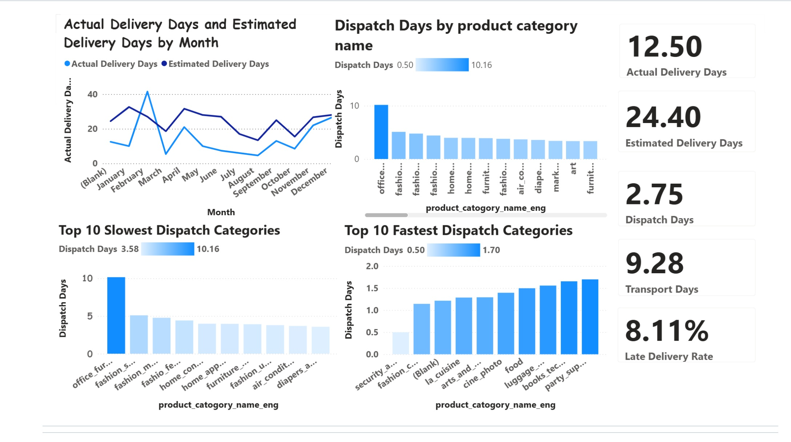

# Olist_eCommerce_Delivery_Performance_Analysis

## Olist eCommerce Delivery Performance Analysis (Power BI)
## Project Overview

This project analyses delivery performance for Olist, a Brazilian eCommerce marketplace that connects small businesses to customers across multiple online platforms.

Using the public Olist eCommerce dataset, the objective of this project was to evaluate delivery efficiency, identify delays in the order fulfilment process, and highlight product categories that contribute to slow dispatch or delivery times.

A Power BI dashboard was developed to provide insights into delivery timelines and operational performance.

## Business Objective

The goal of this analysis was to evaluate the efficiency of the order fulfilment process and identify opportunities to improve delivery performance.

Key focus areas include:

Comparing actual delivery time vs estimated delivery time

Identifying product categories with slow dispatch performance

Measuring delivery reliability and delay rates

Analysing monthly delivery performance trends

## Dataset

The dataset used in this project is the Brazilian eCommerce Public Dataset by Olist, containing information on approximately 100,000 orders from 2016–2018.

The dataset includes multiple dimensions of the eCommerce process:

Order status and timestamps

Product categories

Seller and customer locations

Payment information

Shipping and delivery data

Customer reviews

Geolocation data for Brazilian zip codes

These tables were combined to analyse the full order fulfilment process from purchase to delivery.

## Dashboard Features

The Power BI dashboard focuses on delivery performance and logistics efficiency through the following visualisations:

Actual vs Estimated Delivery Time by Month
Line chart showing delivery performance trends and delays over time.

Dispatch Time by Product Category
Bar chart identifying which categories require longer processing times before shipment.

Top 10 Slowest Dispatch Categories
Categories with the longest average dispatch time.

Top 10 Fastest Dispatch Categories
Categories with the most efficient order processing.

Key Performance Indicators (KPIs)

Average actual delivery days

Average estimated delivery days

Average dispatch days

Average transport days

Late delivery rate

These metrics provide a clear overview of operational performance and potential inefficiencies.

## Key Insights

The analysis highlights several operational insights:

Certain product categories experience longer dispatch times, contributing to delivery delays.

Differences between estimated and actual delivery times indicate areas where logistics planning can be improved.

Delivery performance varies across months, suggesting possible seasonal or operational effects.

Monitoring dispatch and transport times can help identify bottlenecks in the fulfilment process.

## Business Recommendations

The analysis suggests several opportunities to improve delivery performance:

• Product categories with slow dispatch times may benefit from improved warehouse processing or inventory management.

• Monitoring the gap between estimated and actual delivery times could help refine logistics planning.

• Reducing dispatch delays in the slowest product categories could significantly lower the overall late delivery rate.

These insights could help improve customer satisfaction and operational efficiency.

## Tools Used

Power BI – data modelling and dashboard creation

Data visualisation – KPI tracking and performance analysis

Exploratory data analysis – identifying delivery trends and inefficiencies

## Skills Demonstrated

Power BI dashboard development

Logistics and delivery performance analysis

KPI design and operational reporting

Data modelling across multiple datasets

Translating data into business insights
